# My Reddit Clone

Welcome to my Reddit Clone. This is my 4th milestone project for the code institute course. The purpose of this project is to create a full stack web app, making use of a Full Stack Framework, and connecting it to a database to demonstrate CRUD functionality.

My Reddit clone will give the user the ability to create posts and share their ideas and content with each other. Posts can be upvoted and are shown in chronological order.

The project is hosted as a heroku app here: [My Reddit Clone](https://reddit-clone-matt-m.herokuapp.com/)

## Table of Contents

1. ### [User Experience (UX)](#user-experience-ux)
    1. [Strategy](#strategy)
        1. [Project Goals](#project-goals)
        2. [Strategy Table](#strategy-table)
        3. [User Goals](#user-goals)
    2. [Scope](#scope)
        1. [User Stories](#user-stories)
    3. [Structure](#structure)
    4. [Skeleton](#skeleton)
    5. [Surface](#surface)

### [Deployment](#deployment)

## **User Experience (UX)**
This section outlines the desired user experience: What strategies are employed, user stories, scope, site structure, wireframes and visual appearence.
### **Strategy**
#### Project Goals
---
* The site should be paginated to separate funtionality between displaying content, and, viewinf and editing content.
* The site should be fully responsive across a number of different breakpoints and screen resolutions.
* Content should readily present itself to the user.
* The site should be intuitive and functionality should be easy to pick up.
* There should be full CRUD functionality implemented with an externally hosted database.

#### Strategy Table
---
I used a stategy table to determine whether the project could be delivered in one go. From the table, it is clear that the project will need two phases to complete. I tried to use the table to split the user goals/stories into core/high priority, medium priorty and low priorty categories.

Opportunity / Problem | Importance | Viability / Feasibility
--- | --- | ---
Responsive design | 5 | 5
Account registration | 5 | 5
Choose from a list of profile picture | 3 | 2
Social media single-sign-on | 3 | 2
Create, read, edit and delete posts | 5 | 4
Create and read comments | 5 | 4
Search for posts based on cateogry/name | 3 | 1
Add categories to posts | 4 | 3
Upvote posts | 5 | 5
Downvote AND Upvote posts | 5 | 3
Present Posts to user based on favourite categories | 3 | 2
Present posts to user based on recently liked | 3 | 4

**Total** | **49** | **41**


### ***Scope***

#### User Stories
---
There were a lot of different user stories for this project, I decided to split them into 2 phases, implementing the highest priority and core features in the first phase. Lower priority features could be completed in the second phase of the project.

#### Core/High Priority Features (Phase 1)
---
* As a User I can view different site pages so that I can view content feeds and specific posts separately.
* As a User I can toggle upvote posts so that I can engage with the site content and promote content I like.
* As a User I can create posts so that I can share my content with other site users.
* As an User I can view a single post so that I can see focused content and further post details.
* As a User I can edit or remove my posts so that I can ensure that my content is accurate, up to date and that I can remove content that I no longer want.
* As a User I can comment on a post so that I can interact with either mine, or other users content and take part in conversations.
* As a Site Admin I can remove a post so that I can I can ensure that posts comply with site policies.
* As a User I can register an account so that I can interact with existing posts and create my own.

#### Medium Priority Features (Phase 2)
---
* As a User I can edit a comment so that I can ensure that my comments are accurate and express myself clearly.
* As a User I can downvote a post so that I can see less content of that nature.
* As a User I can choose from a list of profile pictures so that I can further express myself on the site.
* As a User I can choose from a list of categories to list my post under so that I can provide my content to a more focused audience.

#### Low Priortiy Features (Phase 2)
---
* As a User I can see posts presented to me that I recently liked so that I can see liked and see more focused content easier.
* As a User I can see posts recommended to me based on favourite categories so that I can consume more focus content and access liked content easier.
* As a User I can sign up/sign into the site using my social accounts so that the login process is seamless and easy.
* As a Site User I can search site content filtering by name and category so that I can easily find content that I'm interested in.
* As a Site Admin I can disapprove comments so that I can temporarily remove content from public view that violates site policies.
* As a User I can flag posts as innappropriate so that I can report content that violtates site policies to admins

### Project Management
---
I used github projects to track the user story implementation for the project. I logged a different issue in the issues pannel for each feature thatI wanted to implment and displayed them on a Kanban style board. Each ticket was tagged to indicate its priority, phase in the project, and wehter or not it was a core feature.

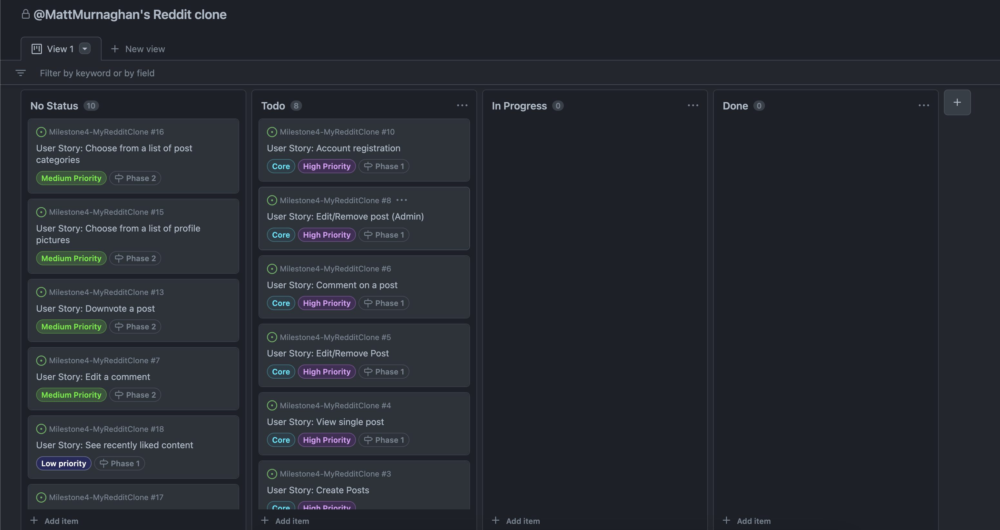*GitHub Kanban*

### Site structure
___

I used lucid chart to organise the site structure. This map shows what is available to an authenticated user vs a user that is visiting the site for the first time.

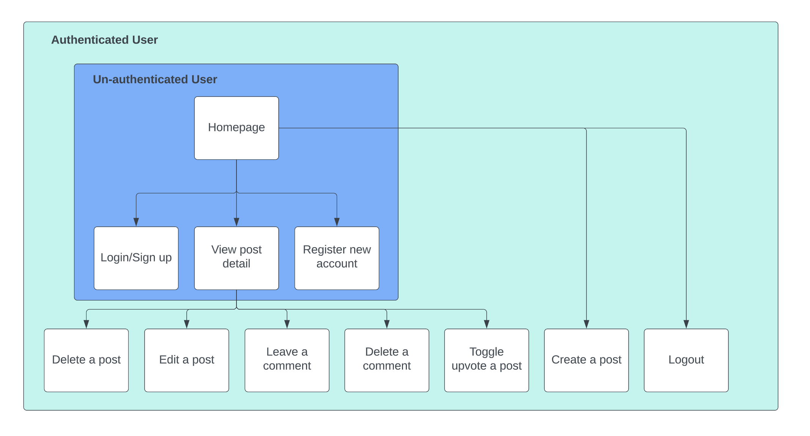*Site Structure*

The above graphic demonstrates the extra fucntionality that is available to authenticated user once they are logged into their account, allowing them the ability to create, edit and delete posts as well as the ability to toggle upvote a post.

### Database Model
---
I also used lucidchart to create the ERD (Entity Relationship Diagram) for this project. This ERD shows the three different models employed for this project, a Post, Comment and User model. The user model is created and managed by the allauth module and as such has some extra methods and fields that are not shown, but it was necessary to show its user ID field as this is the one that would be used most frequently.

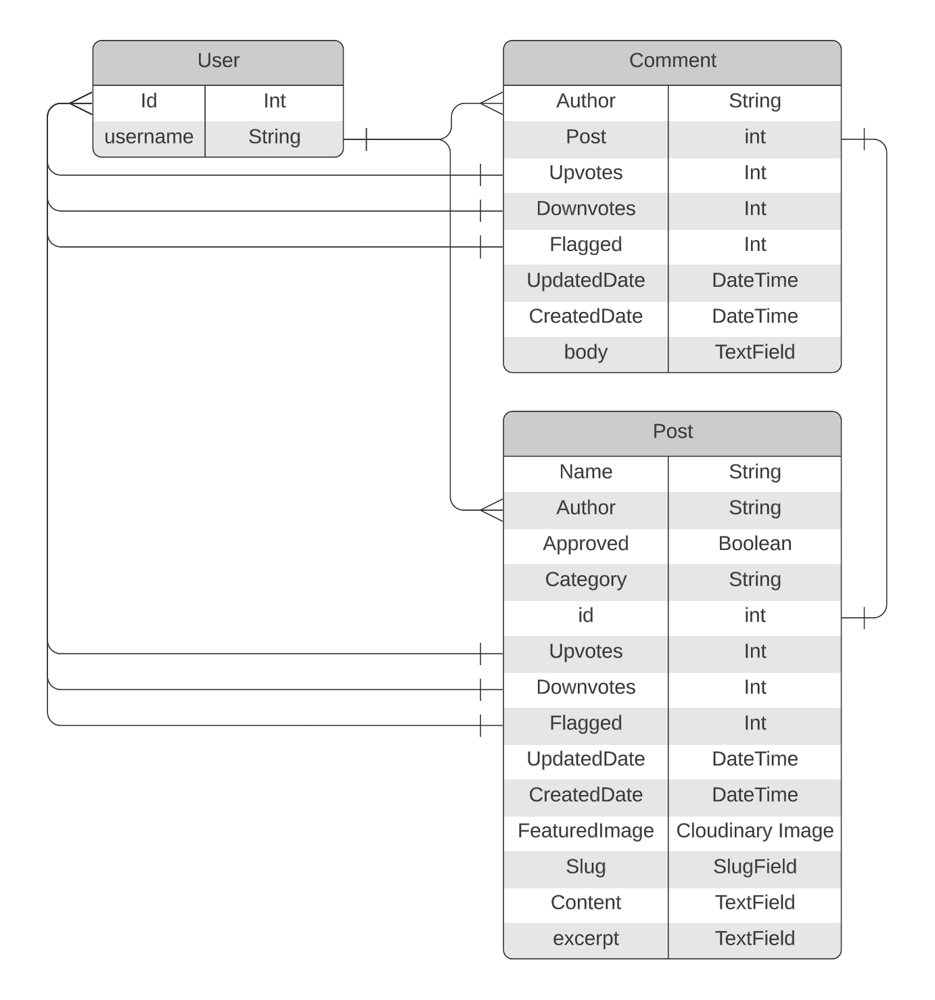*ERD*

**User Model**
* Has a unique user ID and username field.

**Comment Model**
* Has an author field, populated by the username provided by the username field from the user model
* Each comment has an associated post, referred to by the unique post ID field from the post model.
* Comments can be upvoted, capturing the user id from the voter to ensure that a user cannot upvote a post multiple times.
* The same logic can be said for the downvote field. The upvote and downvote fields will keep track of each other to ensure that a user cannot upvote and downvote a post at the same time.
* Comments can be flagged by multiple users. Their user ID is captured when they flag a comment. When checking if a comment is flagged, any postiive volue (all user IDs are positive) will return a truthy value.

**Post Model**
* Has a name field that is created by the author of the post. This is not unique, multiple posts can be created under the same name.
* Has a unique author field, each post has a unique author assigned to it, populated by the username of the author.
* Posts are approved by default when created, but can later be dis-approved by an admin if flagged and found to violate site policies.
* Posts can have an assigned category, assigned when the post is created.
* Posts have a unique ID field that can comments are referenced to. Allows for the querying of specific posts.
* Upvotes and downvotes function the same way as in the comment model, as does flagging.

### Skeleton
---
I used Balsamiq to create the wireframes for this project.

The wireframes can be found here: [wireframes](docs/wireframes/milestone-4-wireframes.pdf)

### Surface
---
The color scheme used for thi project was dark. I was aiming to make my site look slick and modern.

## **Features**
The site is built to be fully responsive, scaling well on mobiles, desktops and devices inbetween.

It is a paginated site consisting of 6 main layouts:
1. Sign in
2. Sign out
3. Register new user
4. Homepage
5. Single post
6. Create post

### Sign in/ Sign out
---
These pages are quite similar to each other. as they both make use of oostrap templates and the django allauth package. They allow the user to sign into an existing account using a case sensitive password and username.

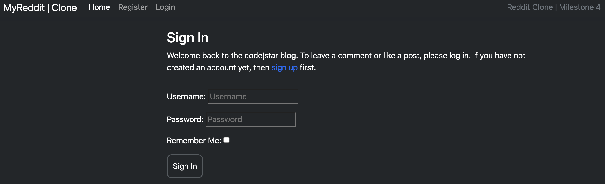*Sign in Desktop*

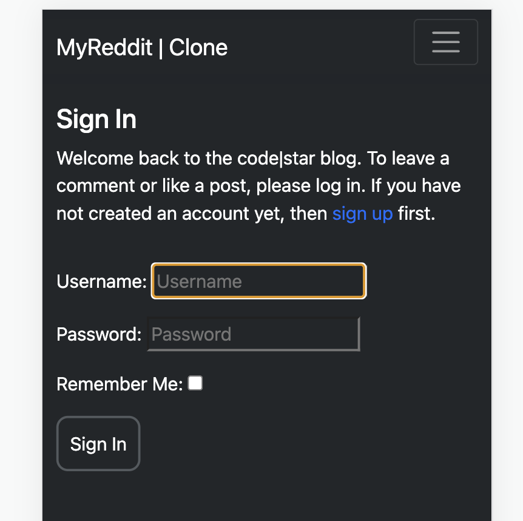*Sign in Mobile*


### Register a new user
---
The register a new user page is very similar to the sign in and sign out templates provided by allauth, some minor styling has been applied to differentiate it and make it fit the theme of the rest of the site.

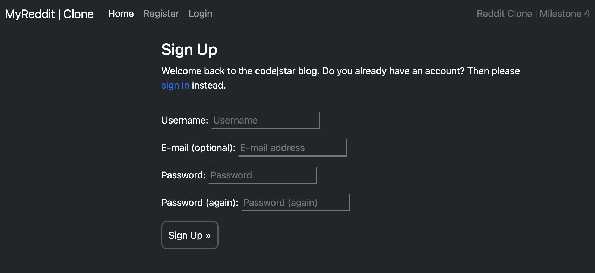*Register new user Desktop*

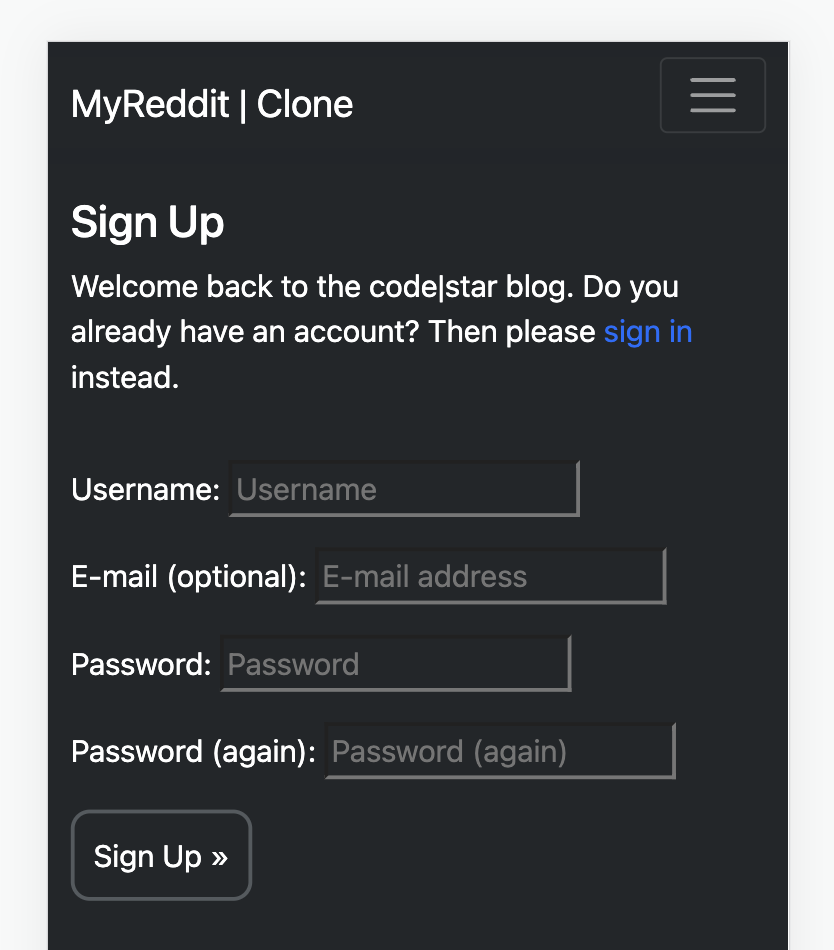*Register new user Mobile*

### Homepage
---
The homepage is the main page you are greeted with when visiting the site. It can be viewed without an account, but you cannot like or comment on a post if you are not logged in as an authenticated user. From here, you can click into individual posts to view them in greater detail, or make changes to them if you are the owner of a post. You can also create a new post from this page using the create post button.


## Deployment
I deployed my Django app to Heroku early to avoid any issues with deployment and to make testing easier by operating in the environment that the app was going to be hosted in.

1. I created an elephant SQL DB to host my models and data.
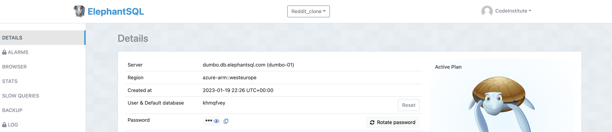*My Elephant SQL Dashboard*


2. I created the Heroku app that was going to host my project.
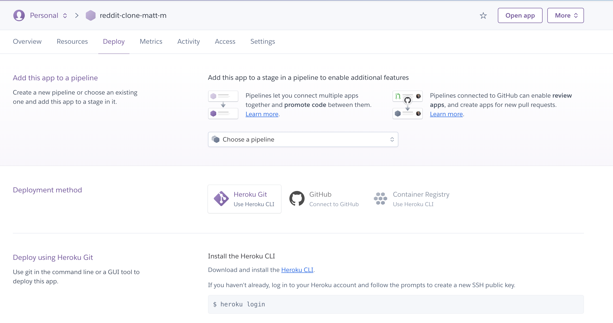*My Heroku App Dashboard*


3. I connected my GitHub repo housing my project code to my Heroku app using the Heroku GUI.
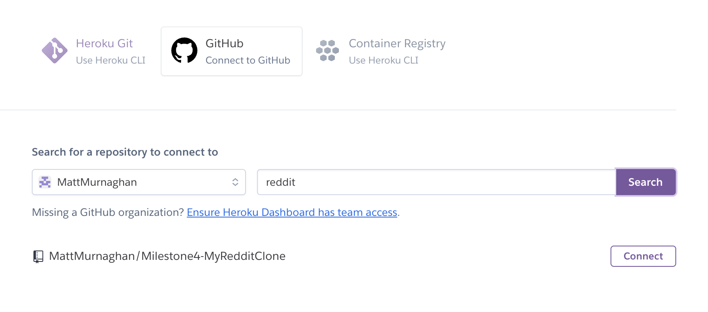*Link Heroku and GitHub repo*


4. I created 3 new config variables in the Heroku app settings for the hosted version of the project to access the external resources it needed, e.g static files on Cloudinary and the Elephant SQL database.<br>
(I created a variable called DISABLE_COLLECTSTATIC with a value of 1 to prevent Heroku from trying to retrieve static files that arent populated yet during early deployment.)
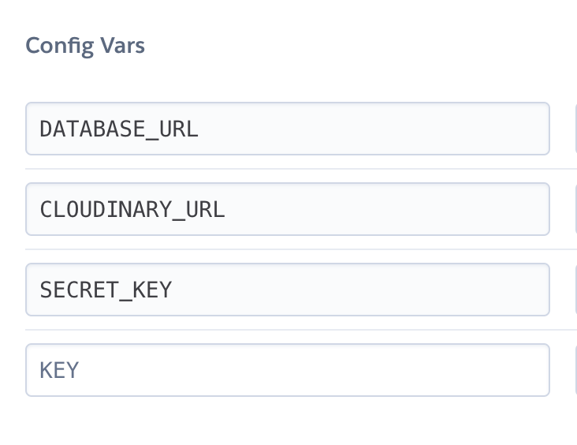*My Heroku config Variables*


5. I created an env.py file with a similar set of config variables for use in local development, so that testing could be done on the local server before being pushed to the Heroku platform. This file was in the .gitgnore file as it contained private information for use in development only.
    ```
    import os
    os.environ["DATABASE_URL"] = \
        'my_database_url'

    os.environ["SECRET_KEY"] = \
        'super_secret_key'

    os.environ['CLOUDINARY_URL'] = \
        'my_cloudinary_url'
    ```

6. I updated the installed apps list in the settings.py file to let the django framework know that it was okay to use cloudinary as a place to pull resources from. I also updated the Django constants relating to static file paths and media storage paths in settings.py to also use Cloudinary based assets.
    ```
    STATIC_URL = '/static/'
    STATICFILES_STORAGE = \
        'cloudinary_storage.storage.StaticHashedCloudinaryStorage'
    STATICFILES_DIRS = [os.path.join(BASE_DIR, 'static')]
    STATIC_ROOT = os.path.join(BASE_DIR, 'staticfiles')

    MEDIA_URL = '/Media/'
    DEFAULT_FILE_STORAGE = 'cloudinary_storage.storage.MediaCloudinaryStorage'
    ```
    The templates path also needed to be updated here, as well as the templates key telling Django where to look for templates in the default TEMPLATES object.
    ```
    TEMPLATES_DIR = os.path.join(BASE_DIR, 'templates')
    
    # and
    
    TEMPLATES = [
        {
            'BACKEND': 'django.template.backends.django.DjangoTemplates',
            'DIRS': [TEMPLATES_DIR],
            .
            .
            .
                ],
            },
        },
    ]
    ```

7. I updated the ALLOWED_HOSTS constant to let Django know that my Heroku App had permission to host its content. I also added localhost to allow the app to be run on a local development server.
    ```
    ALLOWED_HOSTS = ['reddit-clone-matt-m.herokuapp.com', 'localhost']
    ```

8. I created the required directories to store assets in: media, templates and static, as well as creating a Procfile (Process file) to instruct Heroku on how to run the project, and whether it should run the app as a webserver or not. I used [gunicorn](#gunicorn) as the webserver to handle my projects http requests.
    ```
    web: gunicorn reddit_clone.wsgi
    ```

9. The app was ready for deployment and showed the Django skeleton template for an empty Django app when viewing on the Heroku app link.
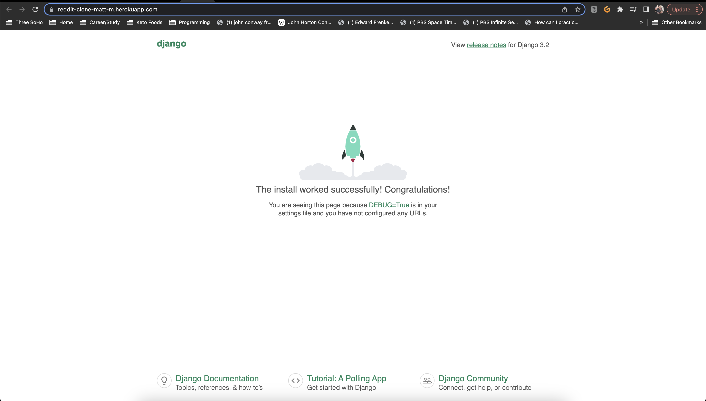*Django Skeleton Template hosted on Heroku*